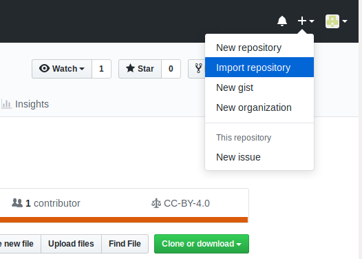
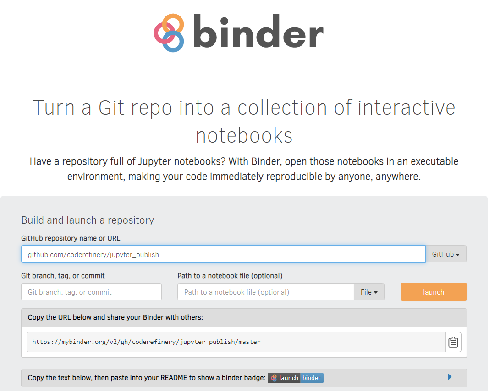

## Publication ready scientific reports and presentations with Jupyter notebooks


- All source codes are provided under [](https://opensource.org/licenses/MIT)
- All documents are provided under 
[](https://creativecommons.org/licenses/by/4.0/)

[](https://mybinder.org/v2/gh/coderefinery/jupyter_publish/master?urlpath=lab/tree/index.ipynb)

The main idea with this repository is to show how to share all the [research objects](http://www.researchobject.org/) that are part of a scientific workflow and provide a "fully" reproducible environment from one single entry point using [Binder](https://mybinder.readthedocs.io/en/latest/).


This workshop has been developed within the [CodeRefinery](https://coderefinery.org) project. CodeRefinery is  funded by [Nordic e-Infrastructure Collaboration](https://neic.no/) (NeIC) and aims at advancing FAIRness of Software management and development practices so that research groups can collaboratively develop, review, discuss, test, share and reuse their codes.   CodeRefinery also deliver 3-day workshops within the Nordic countries, namely in Iceland, Denmark, Norway, Sweden, Finland and Estonia.

# Step-1: Reproducible "research"

Reading a scientific paper is usually only the first step and far insufficient to fully re-implement and understand what has been achieved. It gives the overall idea, and details on the methodology but very little information on how to do it yourself.

Using [Binder](https://mybinder.readthedocs.io/en/latest/), you can read the paper and reproduce (and even re-generate) it.

Let's try it out [here](https://mybinder.org/v2/gh/coderefinery/jupyter_publish/master?urlpath=lab/tree/index.ipynb). 

The link above will open a JupyterLab on your browser with all the files and environment contained in this repository. 

You will learn later (following [jupyter_publish-5.ipynb](jupyter_publish-5.ipynb)) how we created this repository with a fully reproducible environment that includes latex, matplotlib, etc. running with Binder. 

The workshop is organized with 5 sections from getting familiar with JupyterLab to share and publish your jupyter notebooks using Binder:

- [Introduction to JupyterLab](jupyter_publish-1.ipynb)
- [A first notebook to get familiar with JupyterLab](jupyter_publish-2.ipynb)
- [JupyterLab git extension](jupyter_publish-3.ipynb)
- [Convert your notebook with ipypublish](jupyter_publish-4.ipynb)
- [Share and Publish Jupyter notebooks](jupyter_publish-5.ipynb)

The [pdf document](jupyter_publish.pdf) has been generated with the following command:

```
nbpublish -f latex_ipypublish_all -pdf jupyter_publish
```

Where `jupyter_publish` is this repository.


# Step-2: Beyond the state of the art

Being able to reproduce what someone has published is the first step but our main motivation as a researcher is to use the paper we read as a starting point to go beyond the state of the art and generate new results (using new datasets or changing/adapting algorithms, etc.).

Sharing your [research objects](http://www.researchobject.org/) with Binder makes this step much easier and can help you to be more visible as a researcher (by increasing the number of citations).

## Using a repository as a starting point for your new research work

1.  Import this repository directly on GitHub. 

    

**Note**: you may fork it instead if you are willing to keep a "link" with the original work. 

     
2.  Once you have created your repository go to [https://mybinder.org/](https://mybinder.org/)

3.  Enter your repository address and **make sure you replace** *coderefinery* by your github *username* and press **launch**
    
    
 **Note**: if you are willing to start JupyterLab instead, add add:
 
```
 urlpath=lab/tree/index.ipynb
```

so if your URL for starting Binder is [https://mybinder.org/v2/gh/coderefinery/jupyter_publish/master/tree/index.ipynb](https://mybinder.org/v2/gh/coderefinery/jupyter_publish/master/tree/index.ipynb) it becomes

[https://mybinder.org/v2/gh/coderefinery/jupyter_publish/master?urlpath=lab/tree/index.ipynb](https://mybinder.org/v2/gh/coderefinery/jupyter_publish/master?urlpath=lab/tree/index.ipynb)

Because in our case, we are willing to start from `index.ipynb` in the launched JupyterLab.

   
Now we have "copied" the original repository with the same reproducible environment e.g. we can reproduce what has been done using Binder and we are now ready to make our own developments using our own Github repository. 

We now have our own Github repository where we can modify and add new developments and share them in the same way using Binder.

## Local installation (optional)

If you need to install it on your laptop or any other computing platform.

- Follow [setup](setup.ipynb)

